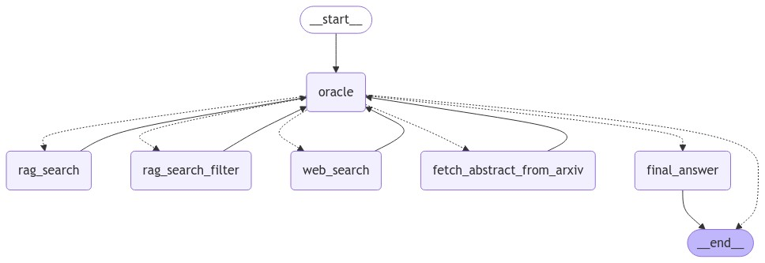

# Research-Assistant-LangGraph
A research assistant tool powered by LangGraph, inspired by hands-on learning from [LangGraph Mastery: Develop LLM Agents with LangGraph on Udemy] course. https://www.udemy.com/course/langgraph-mastery-develop-llm-agents-with-langgraph
-   This project creates an efficient, responsive, and intelligent research tool that harnesses the power of both proprietary and open-source libraries to deliver a high-quality knowledge retrieval experience.
-   **LangGraph** has been used to build agentic research assistant app.

-   This project is a powerful Research Assistant and Knowledge Retrieval System designed to facilitate deep research and answer complex queries across various fields. 
-   By leveraging a combination of **Hugging Face Hub embeddings**, **Pinecone** as a vector database, **GROQ chat model** as the LLM, **Tavily for web search**, and **retrieval-augmented generation (RAG)** techniques, the system allows for nuanced search capabilities. 
-   Users can extract information from an expansive knowledge base and specialized sources such as ArXiv for academic papers, making it ideal for researchers and knowledge workers.
-   **Streamlit** has been used for graphical user interface.

## How to use:
-   Clone this repository `git clone <repository-url>`
-   Initialize poetry with `poetry init -n`
-   Run `poetry config virtualenvs.in-project true` so that virtualenv will be present in project directory
-   Run `poetry env use <C:\Users\username\AppData\Local\Programs\Python\Python310\python.exe>` to create virtualenv in project (change username to your username)
-   Run `poetry shell`
-   Run `poetry install` to install requried packages
-   Run `cd .\src\vectordb\` 
-   Run `python data_ingestion.py` to download papers from arxiv (By default papers on "natural language processing and large language models" will be downloaded)
-   Create `.env` file and insert all keys: `HUGGINGFACEHUB_API_TOKEN`, `PINECONE_API_KEY`, `PINECONE_INDEX_NAME`, `GROQ_API_KEY`, `TAVILY_API_KEY`
-   Run `python create_vectordb.py` to create pinecone vector database (it will take some time to complete)
-   Run `cd ../..`
-   Run `streamlit run app.py`
